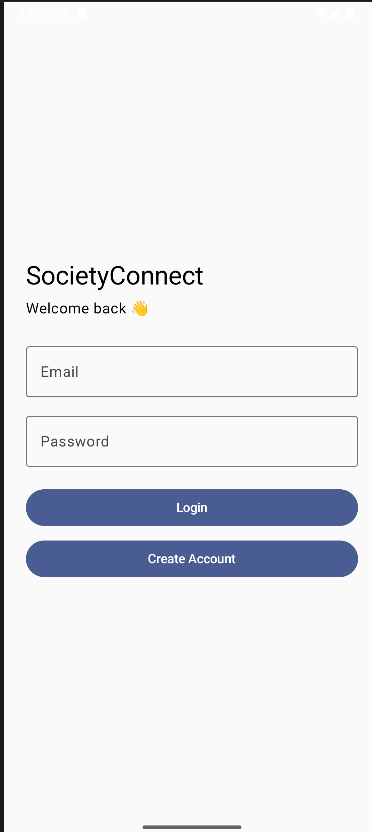
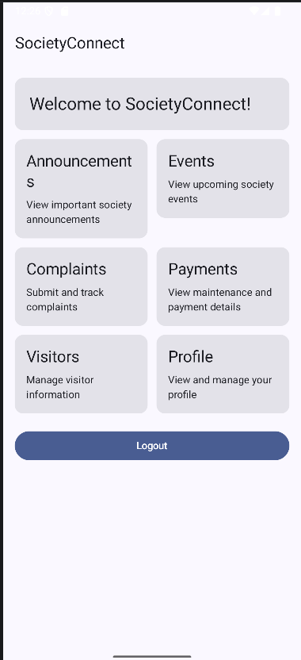
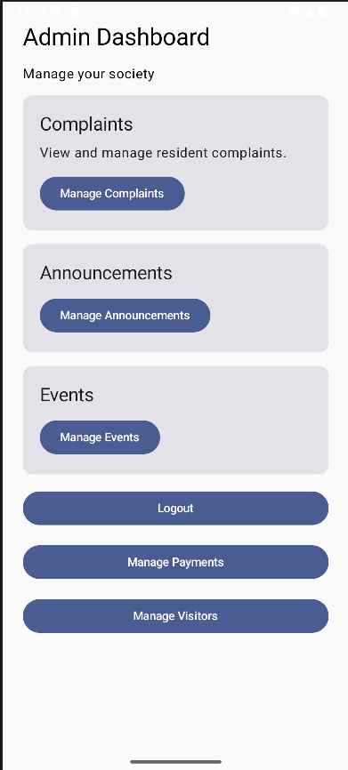

# 🏢 SocietyConnect

## Smart Residential Society Management Android Application

SocietyConnect is an Android-based residential society management application designed to provide a centralized digital platform for residents and society administrators.

The application simplifies common residential society activities such as announcements, events, complaint management, payment tracking, visitor management, and resident profile management.

The system provides separate role-based experiences for **Residents** and **Administrators**, with Firebase Authentication and Cloud Firestore used as the backend services.

---

# 📑 Table of Contents

- [1. Project Overview](#1-project-overview)
- [2. Problem Statement](#2-problem-statement)
- [3. Proposed Solution](#3-proposed-solution)
- [4. Project Objectives](#4-project-objectives)
- [5. Target Users](#5-target-users)
- [6. Key Features](#6-key-features)
- [7. User Roles](#7-user-roles)
- [8. Application Workflow](#8-application-workflow)
- [9. Technology Stack](#9-technology-stack)
- [10. Architecture](#10-architecture)
- [11. Project Structure](#11-project-structure)
- [12. Database Design](#12-database-design)
- [13. Firestore Collections](#13-firestore-collections)
- [14. Authentication and Authorization](#14-authentication-and-authorization)
- [15. Security](#15-security)
- [16. Functional Requirements](#16-functional-requirements)
- [17. Non-Functional Requirements](#17-non-functional-requirements)
- [18. Application Modules](#18-application-modules)
- [19. Data Flow](#19-data-flow)
- [20. Firebase Integration](#20-firebase-integration)
- [21. Validation and Error Handling](#21-validation-and-error-handling)
- [22. Setup and Installation](#22-setup-and-installation)
- [23. Firebase Configuration](#23-firebase-configuration)
- [24. Running the Application](#24-running-the-application)
- [25. Testing](#25-testing)
- [26. Test Scenarios](#26-test-scenarios)
- [27. Screenshots](#27-screenshots)
- [28. Video Demonstration](#28-video-demonstration)
- [29. GitHub Repository](#29-github-repository)
- [30. Limitations](#30-limitations)
- [31. Future Enhancements](#31-future-enhancements)
- [32. Scalability Considerations](#32-scalability-considerations)
- [33. Production Considerations](#33-production-considerations)
- [34. Project Outcomes](#34-project-outcomes)
- [35. Conclusion](#35-conclusion)
- [36. Author](#36-author)

---

# 1. Project Overview

SocietyConnect is a modern Android application for residential society management.

The application provides a centralized platform where residents can access society information and submit requests, while administrators can manage society operations.

The major functional areas include:

- User authentication
- Resident profiles
- Society announcements
- Society events
- Complaint management
- Payment management
- Visitor management
- Role-based administration
- Firebase cloud data storage
- Firestore security rules

The project is developed using **Kotlin, Jetpack Compose, Material 3, Firebase Authentication, and Cloud Firestore**.

---

# 2. Problem Statement

Residential societies commonly depend on multiple disconnected communication and management methods such as:

- Physical notice boards
- Paper complaint registers
- Phone calls
- Messaging groups
- Manual visitor records
- Manual payment tracking
- Separate communication channels

These approaches can result in:

- Delayed communication
- Difficulty tracking complaints
- Lack of centralized records
- Manual administrative work
- Limited transparency
- Difficulty accessing historical information
- Inefficient visitor management

Residents may not always have a clear way to determine whether a complaint has been received, processed, or resolved.

Similarly, administrators may need to manage information across multiple channels.

---

# 3. Proposed Solution

SocietyConnect provides a centralized Android application that combines multiple residential society-management activities into one platform.

The application provides:

### Resident Features

- Secure registration and login
- Profile management
- Announcement viewing
- Event viewing
- Complaint submission and tracking
- Payment tracking
- Visitor request submission
- Visitor status tracking

### Administrator Features

- Admin dashboard
- Complaint management
- Announcement management
- Event management
- Payment management
- Visitor request management
- Status updates
- Resident-related administrative operations

---

# 4. Project Objectives

The primary objectives of SocietyConnect are:

1. Digitize common residential society-management activities.
2. Provide a centralized communication platform.
3. Reduce manual administrative processes.
4. Improve complaint transparency.
5. Simplify visitor request management.
6. Provide structured payment tracking.
7. Provide role-based access control.
8. Store application data using a cloud database.
9. Improve accessibility of society information.
10. Provide a foundation for future production-level enhancements.

---

# 5. Target Users

SocietyConnect is designed primarily for two user categories.

## 🏠 Residents

Residents can use the application to:

- Access society information
- View announcements
- View events
- Submit complaints
- Track complaint status
- View payment records
- Submit visitor requests
- Track visitor approvals
- View their profile

## 🛡️ Administrators

Administrators can use the application to:

- Manage complaints
- Create announcements
- Manage events
- Manage payments
- Review visitor requests
- Approve or reject visitor requests
- Monitor society activities

---

# 6. Key Features

## 🔐 Authentication

- Resident registration
- User login
- Firebase Authentication
- Email/password authentication
- Input validation
- Authentication error handling
- Role-based navigation

## 👤 Profile Management

Residents can view their:

- Name
- Email
- Phone number
- Flat number
- User role

Profile data is stored in Cloud Firestore.

## 📢 Announcement Management

### Residents

Residents can:

- View announcements
- Read announcement details
- View announcement dates

### Administrators

Administrators can:

- Create announcements
- View announcements
- Manage announcement information

## 📅 Event Management

### Residents

Residents can:

- View upcoming events
- View event descriptions
- View event dates
- View event times
- View event locations

### Administrators

Administrators can:

- Create events
- Manage event information

## 📝 Complaint Management

Residents can:

- Submit complaints
- Add complaint titles
- Add complaint descriptions
- View submitted complaints
- Track complaint status

Administrators can:

- View all complaints
- Review submitted complaints
- Mark complaints as `IN_PROGRESS`
- Mark complaints as `RESOLVED`

### Complaint Lifecycle

```text
Resident
   |
   v
Submit Complaint
   |
   v
SUBMITTED
   |
   v
Admin Review
   |
   v
IN_PROGRESS
   |
   v
RESOLVED
```

## 💰 Payment Management

The payment module provides structured payment tracking between administrators and residents.

Administrators can:

- Select a resident
- Create payment records
- Specify payment amount
- Specify payment title
- Specify due date
- Update payment status

Residents can:

- View their payment records
- View payment amount
- View payment due date
- View payment status

### Payment Lifecycle

```text
Admin
   |
   v
Select Resident
   |
   v
Create Payment
   |
   v
PENDING
   |
   v
Resident Views Payment
   |
   v
Admin Updates Status
   |
   v
PAID
```

> Note: The current payment module is designed for payment tracking and management. It does not currently process real-time online financial transactions.

## 👥 Visitor Management

Residents can:

- Add visitor information
- Enter visitor name
- Enter visitor phone number
- Specify visit date
- Specify visit time
- Specify visit purpose
- Submit visitor requests
- Track request status

Administrators can:

- View visitor requests
- Approve visitor requests
- Reject visitor requests

### Visitor Lifecycle

```text
Resident
   |
   v
Submit Visitor Request
   |
   v
PENDING
   |
   v
Admin Review
   |
   +-------------+
   |             |
   v             v
APPROVED       REJECTED
```

---

# 7. User Roles

## RESIDENT

The resident role is assigned to newly registered users by default.

Resident access includes:

```text
Home
 ├── Profile
 ├── Announcements
 ├── Events
 ├── Complaints
 ├── Payments
 └── Visitors
```

## ADMIN

The administrator role provides additional management capabilities.

Admin access includes:

```text
Admin Dashboard
 ├── Manage Complaints
 ├── Manage Announcements
 ├── Manage Events
 ├── Manage Payments
 ├── Manage Visitors
 └── Logout
```

---

# 8. Application Workflow

```text
                    SocietyConnect
                          |
                          v
                 Firebase Authentication
                          |
                +---------+---------+
                |                   |
                v                   v
             RESIDENT             ADMIN
                |                   |
                v                   v
        Resident Dashboard    Admin Dashboard
                |                   |
       +--------+--------+     +----+----+----+
       |        |        |     |    |    |    |
       v        v        v     v    v    v    v
 Announcements Events Complaints Complaints Events Payments
       |        |        |     |    |    |    |
       +--------+--------+     +----+----+----+
                |                   |
                v                   v
             Payments            Visitors
                |
                v
             Visitors
```

---

# 9. Technology Stack

| Technology | Purpose |
|---|---|
| Kotlin | Android application development |
| Android SDK | Android platform |
| Jetpack Compose | Declarative UI development |
| Material 3 | UI components and design |
| Firebase Authentication | Authentication |
| Cloud Firestore | Cloud database |
| StateFlow | Reactive UI state |
| ViewModel | Presentation state management |
| Navigation Compose | Application navigation |
| Repository Pattern | Data access abstraction |
| Git | Version control |
| GitHub | Source code hosting |
| Android Studio | Development environment |

---

# 10. Architecture

SocietyConnect follows a modular, MVVM-inspired architecture with Repository-based data access.

```text
┌─────────────────────────────────────┐
│              UI Layer               │
│                                     │
│      Jetpack Compose Screens        │
│                                     │
│ Login | Home | Profile | Events     │
│ Announcements | Complaints          │
│ Payments | Visitors | Admin        │
└──────────────────┬──────────────────┘
                   |
                   v
┌─────────────────────────────────────┐
│          Presentation Layer         │
│                                     │
│             ViewModels              │
│                                     │
│ UI State | Validation | Actions     │
└──────────────────┬──────────────────┘
                   |
                   v
┌─────────────────────────────────────┐
│             Data Layer              │
│                                     │
│            Repositories             │
│                                     │
│ AuthRepository                      │
│ ProfileRepository                   │
│ AnnouncementRepository              │
│ EventRepository                     │
│ ComplaintRepository                 │
│ PaymentRepository                   │
│ VisitorRepository                   │
│ Admin Repositories                  │
└──────────────────┬──────────────────┘
                   |
                   v
┌─────────────────────────────────────┐
│              Firebase               │
│                                     │
│ Firebase Authentication             │
│ Cloud Firestore                     │
└─────────────────────────────────────┘
```

### Architecture Responsibilities

| Layer | Responsibility |
|---|---|
| UI | Displays application screens and collects user interaction |
| ViewModel | Holds UI state, validation, and coordinates actions |
| Repository | Handles Firebase data access |
| Model | Represents application data |
| Firebase | Provides authentication and cloud persistence |

---

# 11. Project Structure

```text
com.example.societyconnect
│
├── data
│   │
│   ├── model
│   │   ├── User.kt
│   │   ├── Announcement.kt
│   │   ├── Event.kt
│   │   ├── Complaint.kt
│   │   ├── Payment.kt
│   │   └── Visitor.kt
│   │
│   └── repository
│       ├── AuthRepository.kt
│       ├── ProfileRepository.kt
│       ├── AnnouncementRepository.kt
│       ├── EventRepository.kt
│       ├── ComplaintRepository.kt
│       ├── AdminComplaintRepository.kt
│       ├── AdminAnnouncementRepository.kt
│       ├── AdminEventRepository.kt
│       ├── PaymentRepository.kt
│       ├── AdminPaymentRepository.kt
│       ├── VisitorRepository.kt
│       └── AdminVisitorRepository.kt
│
├── navigation
│   └── AppNavigation.kt
│
├── presentation
│   │
│   ├── auth
│   │   ├── AuthUiState.kt
│   │   ├── LoginViewModel.kt
│   │   ├── LoginScreen.kt
│   │   ├── RegisterViewModel.kt
│   │   └── RegisterScreen.kt
│   │
│   ├── home
│   │   ├── HomeScreen.kt
│   │   └── FeatureScreen.kt
│   │
│   ├── profile
│   │   ├── ProfileUiState.kt
│   │   ├── ProfileViewModel.kt
│   │   └── ProfileScreen.kt
│   │
│   ├── announcements
│   │   ├── AnnouncementUiState.kt
│   │   ├── AnnouncementViewModel.kt
│   │   └── AnnouncementScreen.kt
│   │
│   ├── events
│   │   ├── EventUiState.kt
│   │   ├── EventViewModel.kt
│   │   └── EventScreen.kt
│   │
│   ├── complaints
│   │   ├── ComplaintUiState.kt
│   │   ├── ComplaintViewModel.kt
│   │   └── ComplaintScreen.kt
│   │
│   ├── payments
│   │   ├── PaymentUiState.kt
│   │   ├── PaymentViewModel.kt
│   │   └── PaymentScreen.kt
│   │
│   ├── visitors
│   │   ├── VisitorViewModel.kt
│   │   └── VisitorScreen.kt
│   │
│   └── admin
│       ├── AdminHomeScreen.kt
│       ├── AdminComplaintViewModel.kt
│       ├── AdminComplaintScreen.kt
│       ├── AdminAnnouncementViewModel.kt
│       ├── AdminAnnouncementScreen.kt
│       ├── AdminEventViewModel.kt
│       ├── AdminEventScreen.kt
│       ├── AdminPaymentViewModel.kt
│       ├── AdminPaymentScreen.kt
│       ├── AdminVisitorViewModel.kt
│       └── AdminVisitorScreen.kt
│
├── ui
│   └── theme
│
└── MainActivity.kt
```

---

# 12. Database Design

SocietyConnect uses **Cloud Firestore** as its cloud database.

```text
Firestore
│
├── users
├── announcements
├── events
├── complaints
├── payments
└── visitors
```

---

# 13. Firestore Collections

## 13.1 Users

Collection:

```text
users/{userId}
```

Example:

```json
{
  "uid": "user_uid",
  "name": "Resident Name",
  "email": "resident@example.com",
  "phone": "9876543210",
  "flatNumber": "21,2",
  "role": "RESIDENT"
}
```

Possible roles:

```text
RESIDENT
ADMIN
```

---

## 13.2 Announcements

Collection:

```text
announcements/{announcementId}
```

Example:

```json
{
  "title": "Society Meeting",
  "description": "Monthly society meeting",
  "date": "2026-09-20",
  "createdBy": "ADMIN"
}
```

---

## 13.3 Events

Collection:

```text
events/{eventId}
```

Example:

```json
{
  "title": "Society Celebration",
  "description": "Community celebration",
  "date": "2026-09-20",
  "time": "6:00 PM",
  "location": "Society Clubhouse",
  "createdBy": "ADMIN"
}
```

---

## 13.4 Complaints

Collection:

```text
complaints/{complaintId}
```

Example:

```json
{
  "userId": "resident_uid",
  "title": "Water Leakage",
  "description": "Water leakage near staircase",
  "status": "SUBMITTED",
  "createdAt": 1750000000000
}
```

Possible statuses:

```text
SUBMITTED
IN_PROGRESS
RESOLVED
```

---

## 13.5 Payments

Collection:

```text
payments/{paymentId}
```

Example:

```json
{
  "userId": "resident_uid",
  "title": "Monthly Maintenance",
  "amount": 2500.0,
  "dueDate": "2026-09-30",
  "status": "PENDING",
  "createdAt": 1750000000000
}
```

Possible statuses:

```text
PENDING
PAID
```

---

## 13.6 Visitors

Collection:

```text
visitors/{visitorId}
```

Example:

```json
{
  "userId": "resident_uid",
  "visitorName": "Rahul",
  "phone": "9876543210",
  "visitDate": "2026-09-15",
  "visitTime": "6:00 PM",
  "purpose": "Visiting resident",
  "status": "PENDING",
  "createdAt": 1750000000000
}
```

Possible statuses:

```text
PENDING
APPROVED
REJECTED
```

---

# 14. Authentication and Authorization

Firebase Authentication is used to authenticate users.

The authentication flow is:

```text
User
 |
 v
Register / Login
 |
 v
Firebase Authentication
 |
 v
Firebase UID
 |
 v
Firestore users/{uid}
 |
 v
Read role
 |
 +------------------+
 |                  |
 v                  v
RESIDENT           ADMIN
 |                  |
 v                  v
Home              Admin Home
```

New registrations are assigned:

```text
RESIDENT
```

The user's Firestore role determines role-based navigation and access.

---

# 15. Security

Firestore Security Rules are used to restrict access to application data.

The security model follows role-based access control.

### Users

Residents can access their own profile.

Administrators can access resident information required for administrative operations.

### Complaints

Residents can:

- Create their own complaints
- Read their own complaints

Administrators can:

- Read complaints
- Update complaint status

### Announcements

Authenticated users can read announcements.

Administrators can:

- Create
- Update
- Delete

announcements.

### Events

Authenticated users can read events.

Administrators can:

- Create
- Update
- Delete

events.

### Payments

Residents can read their own payment records.

Administrators can:

- Create payment records
- Read payment records
- Update payment status
- Delete payment records

### Visitors

Residents can create and read their own visitor requests.

Administrators can:

- Read visitor requests
- Update visitor status

---

# 16. Functional Requirements

## Authentication

- Users shall be able to register.
- Registered users shall be able to log in.
- Required fields shall be validated.
- Firebase Authentication shall authenticate users.
- The application shall determine the user's role after authentication.

## Announcements

- Residents shall be able to view announcements.
- Administrators shall be able to create announcements.
- Administrators shall be able to manage announcements.

## Events

- Residents shall be able to view events.
- Administrators shall be able to create events.
- Administrators shall be able to manage events.

## Complaints

- Residents shall be able to submit complaints.
- Residents shall be able to view their complaints.
- Administrators shall be able to view complaints.
- Administrators shall be able to update complaint status.

## Payments

- Residents shall be able to view their payment records.
- Administrators shall be able to create payment records.
- Administrators shall be able to update payment status.

## Visitors

- Residents shall be able to submit visitor requests.
- Residents shall be able to view visitor request status.
- Administrators shall be able to view visitor requests.
- Administrators shall be able to approve or reject visitor requests.

---

# 17. Non-Functional Requirements

## Performance

The application should provide responsive navigation and avoid unnecessary database operations.

## Security

Firebase Authentication and Firestore Security Rules are used to restrict unauthorized access.

## Usability

Jetpack Compose and Material 3 provide a consistent Android user interface.

## Reliability

The application handles:

- Loading states
- Empty states
- Validation errors
- Firebase errors
- Authentication errors

## Maintainability

The project separates:

- Models
- Repositories
- ViewModels
- UI screens
- Navigation

This makes individual modules easier to modify and maintain.

## Scalability

The modular architecture and Firestore collection structure allow additional society-management functionality to be added in future versions.

---

# 18. Application Modules

| Module | Resident | Admin |
|---|---|---|
| Authentication | Register / Login | Login |
| Profile | View | Administrative access where required |
| Announcements | View | Create / Manage |
| Events | View | Create / Manage |
| Complaints | Submit / Track | Manage |
| Payments | View | Create / Manage |
| Visitors | Submit / Track | Approve / Reject |

---

# 19. Data Flow

A typical request follows:

```text
Compose UI
    |
    v
ViewModel
    |
    v
Repository
    |
    v
Firebase Firestore
    |
    v
Repository Result
    |
    v
ViewModel StateFlow
    |
    v
Compose UI
```

### Example: Complaint Submission

```text
ComplaintScreen
      |
      v
ComplaintViewModel
      |
      v
ComplaintRepository
      |
      v
Firebase Firestore
      |
      v
complaints collection
```

---

# 20. Firebase Integration

SocietyConnect uses Firebase as its cloud backend.

```text
Firebase
│
├── Authentication
│   ├── User Registration
│   ├── User Login
│   └── Firebase UID
│
└── Cloud Firestore
    ├── users
    ├── announcements
    ├── events
    ├── complaints
    ├── payments
    └── visitors
```

Firebase provides authentication and cloud data persistence for the current implementation.

---

# 21. Validation and Error Handling

The application validates user input before performing database operations.

Examples include:

- Name validation
- Email format validation
- Phone validation
- Password length validation
- Confirm-password validation
- Complaint validation
- Announcement validation
- Event validation
- Payment amount validation
- Visitor information validation

The application also handles:

```text
Loading
Success
Error
Empty Data
```

Firebase errors are converted into user-readable messages wherever appropriate.

---

# 22. Setup and Installation

## Prerequisites

Install:

- Android Studio
- Android SDK
- JDK 11 or compatible configured JDK
- Git
- Firebase account

## Clone Repository

```bash
git clone YOUR_GITHUB_REPOSITORY_URL
```

Navigate to the project:

```bash
cd SocietyConnect
```

Open the project in Android Studio.

---

# 23. Firebase Configuration

The application requires a Firebase project.

## Step 1 — Create Firebase Project

Create a Firebase project from the Firebase Console.

## Step 2 — Add Android Application

Register the Android application with:

```text
Package Name:
com.example.societyconnect
```

## Step 3 — Download Firebase Configuration

Download:

```text
google-services.json
```

Place it inside:

```text
app/google-services.json
```

> Do not commit sensitive Firebase configuration or secrets to a public repository if your project setup contains credentials that should remain private.

## Step 4 — Enable Authentication

Enable:

```text
Firebase Authentication
    |
    └── Sign-in method
         |
         └── Email/Password
```

## Step 5 — Create Firestore Database

Create a Cloud Firestore database using the default database.

## Step 6 — Configure Security Rules

Publish the Firestore Security Rules required by the application.

---

# 24. Running the Application

1. Open the project in Android Studio.
2. Allow Gradle synchronization to complete.
3. Connect an Android device or start an Android emulator.
4. Select the `app` configuration.
5. Click **Run**.

The application should launch on the selected Android device or emulator.

---

# 25. Testing

Testing should be performed using separate Resident and Admin accounts.

### Authentication

```text
Register Resident
       |
       v
Login
       |
       v
Resident Home
```

### Admin Authentication

```text
Admin Login
     |
     v
Admin Dashboard
```

### Complaint Workflow

```text
Resident submits complaint
        |
        v
SUBMITTED
        |
        v
Admin reviews complaint
        |
        v
IN_PROGRESS
        |
        v
RESOLVED
        |
        v
Resident sees updated status
```

### Announcement Workflow

```text
Admin creates announcement
        |
        v
Firestore
        |
        v
Resident opens Announcements
        |
        v
Announcement displayed
```

### Event Workflow

```text
Admin creates event
        |
        v
Firestore
        |
        v
Resident opens Events
        |
        v
Event displayed
```

### Payment Workflow

```text
Admin selects resident
        |
        v
Creates payment
        |
        v
Resident sees PENDING
        |
        v
Admin marks PAID
        |
        v
Resident sees PAID
```

### Visitor Workflow

```text
Resident submits visitor
        |
        v
PENDING
        |
        v
Admin reviews request
        |
        +-------------+
        |             |
        v             v
    APPROVED       REJECTED
```

---

# 26. Test Scenarios

| Test Case | Expected Result |
|---|---|
| Register with valid details | Account created |
| Register with invalid email | Validation error |
| Register with short password | Validation error |
| Login with valid credentials | User enters application |
| Login with invalid credentials | Error displayed |
| Resident opens profile | Profile information displayed |
| Resident opens announcements | Announcements displayed |
| Admin creates announcement | Announcement saved |
| Resident opens events | Events displayed |
| Admin creates event | Event saved |
| Resident submits complaint | Complaint created as `SUBMITTED` |
| Admin changes complaint status | Updated status displayed |
| Admin creates payment | Payment assigned to resident |
| Resident views payment | Payment displayed |
| Admin marks payment paid | Status becomes `PAID` |
| Resident submits visitor request | Request created as `PENDING` |
| Admin approves visitor | Status becomes `APPROVED` |
| Admin rejects visitor | Status becomes `REJECTED` |
| Unauthorized database access | Firestore denies access |

---

# 27. Screenshots


Example:


## Login Screen



## Resident Dashboard



## Admin Dashboard




---

# 28. Video Demonstration

Add the project demonstration video here:


Video Demonstration:
```text
https://drive.google.com/file/d/1k6a6T6O0FjslNnT_wuRcD0QdL89FdMgi/view?usp=drive_link
```

The demonstration should ideally cover:

1. Resident registration
2. Resident login
3. Resident dashboard
4. Profile
5. Announcements
6. Events
7. Complaint submission
8. Admin login
9. Admin dashboard
10. Complaint management
11. Announcement management
12. Event management
13. Payment management
14. Visitor management
15. Resident viewing updated statuses

---

# 29. GitHub Repository


GitHub Repository:
```text
https://github.com/Bhuvaneshwari-Dhanabal/SocietyConnect
```

---

# 30. Limitations

The current version has the following limitations:

- An integrated online payment gateway is not included.
- Payment management currently focuses on payment tracking rather than real-time financial transaction processing.
- Visitor management does not currently include QR-based visitor verification.
- Push notifications and real-time alerts are not yet implemented.
- Advanced analytics and reporting are not currently available.
- Automated maintenance bill generation is not currently implemented.
- Digital payment receipt generation is not currently implemented.
- Real-time resident-administrator chat is not currently available.
- Advanced security-gate integration is not currently implemented.

---

# 31. Future Enhancements

The following features can be added in future versions:

- Integration of online payment gateways for secure maintenance and other society payments.
- Push notifications for announcements, complaints, payments, events, and visitor approvals.
- QR-code-based visitor verification and security-gate management.
- Automated maintenance bill generation and digital payment receipts.
- Advanced admin dashboard with society statistics, payment reports, and complaint analytics.
- Emergency contact and SOS functionality with quick-access calling.
- Real-time chat and communication between residents and administrators.
- Document sharing for notices, society rules, meeting minutes, and important documents.
- Improved UI/UX and accessibility across different Android devices.
- Cloud-based scalability and additional security enhancements for larger residential communities.

---

# 32. Scalability Considerations

The current architecture provides a foundation for future expansion.

## Database Optimization

Future production versions can use:

- Appropriate Firestore indexes
- Pagination for large collections
- Query optimization
- Data retention policies

## Application Performance

Potential improvements include:

- Efficient state management
- Reduced unnecessary Firestore reads
- Local caching
- Offline support

## Security

Future security improvements can include:

- Stronger role management
- Firebase App Check
- More granular Firestore Security Rules
- Audit logging
- Secure administrative operations

## Monitoring

Production versions can include:

- Crash reporting
- Application analytics
- Performance monitoring
- Error logging
- Administrative audit trails

---

# 33. Production Considerations

Before production deployment, the following areas should be strengthened:

### Authentication

- Strong account-management policies
- Password recovery
- Email verification
- Additional authentication options where required

### Authorization

- Strict role validation
- Granular Firestore Security Rules
- Administrative audit trails

### Data Protection

- Minimize sensitive data collection
- Protect credentials and configuration
- Apply appropriate Firebase security controls

### Performance

- Optimize Firestore queries
- Add pagination
- Reduce unnecessary reads
- Consider offline caching

### Reliability

- Crash monitoring
- Error reporting
- Network failure handling
- Retry strategies where appropriate

---

# 34. Project Outcomes

SocietyConnect demonstrates the implementation of:

- Android application development
- Kotlin programming
- Jetpack Compose UI development
- Material 3
- Firebase Authentication
- Cloud Firestore integration
- Role-based access control
- Repository-based data handling
- ViewModel-based state management
- StateFlow
- CRUD operations
- Input validation
- Error handling
- Firestore Security Rules
- Resident workflows
- Administrator workflows
- Cloud database integration

---

# 35. Conclusion

SocietyConnect provides a centralized mobile platform for managing important residential society activities.

The application demonstrates how modern Android technologies and cloud services can be combined to create a structured society-management solution.

The current implementation establishes a foundation for a larger residential community platform.

Future versions can extend the application with online payments, push notifications, QR-based visitor verification, analytics, real-time communication, automated billing, and additional security capabilities.

---

# 36. Author

## Bhuvaneshwari D

**Project:** SocietyConnect

**Platform:** Android

**Technology:** Kotlin, Jetpack Compose, Firebase

**Architecture:** MVVM-inspired / Repository-based architecture

---

# 📄 License

This project was developed as a technical/academic project.

Copyright © 2026 Bhuvaneshwai D.
